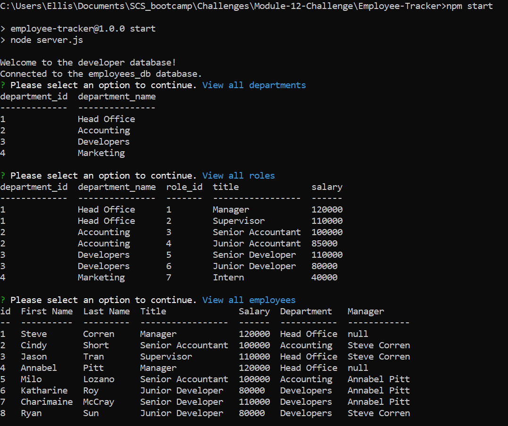
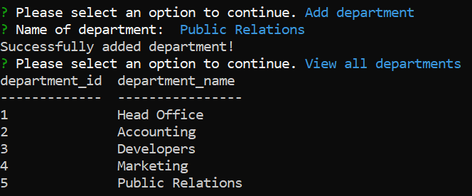
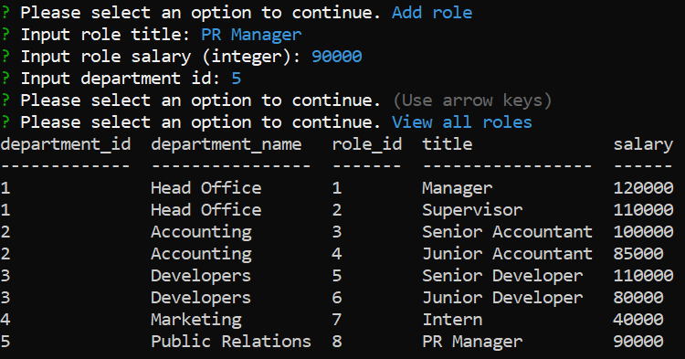
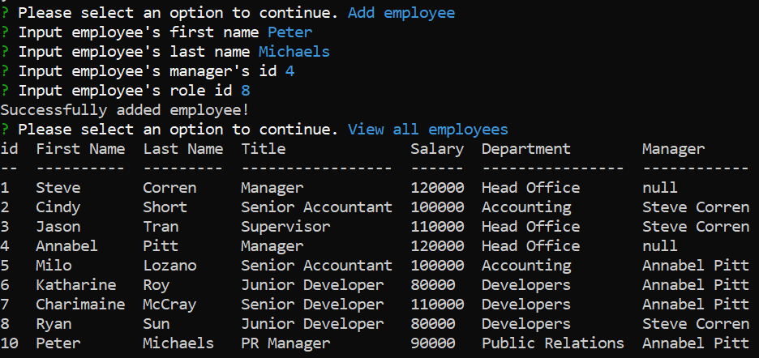
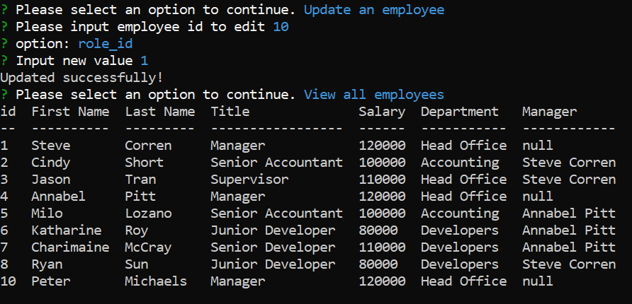

# Employee Database Manager

## Introduction

Program designed to assist with organizing company employee information including names, roles, salaries, and manager identification.

## Table of Contents 
1. [Installation](#installation)
2. [Usage](#usage)
3. [Test](#test)
4. [Credits](#credits)
5. [Licenses](#licenses)

## Installation 

1. Clone project from https://github.com/EllisJLC/Employee_Db. 
2. Navigate to Employee_Db folder and run npm install to install necessary node modules. 
3. Install SQL databases by running db/schema.sql followed by db/seeds.sql to generate and populate data tables. 
4. Run program by inputting "node index.js" in the command window outside of the SQL menu.

## Usage

To organize employee roles and departments in any given company.

## Test

1. Upon starting the program with "node index.js", several options will be presented, including options to view tables, add new entries to said tables, or edit an employee's information. 
2. Select the "View" options to view the necessary data pertaining to the option selected. 
3. Select the "Add" options to add a new department/role/employee with additional queues for necessary details. 
4. Select the "Edit employee" option to select an employee to edit given the option to edit specific values.

## Images
### Viewing the databases

### Adding a department

### Adding a role

### Adding an employee

### Editing an employee

## Credits

Code was created in full by myself, Jia Liang (Ellison) Chen

## Licenses 
[License: MIT](https://img.shields.io/badge/License-MIT-yellow.svg)
The MIT License: https://opensource.org/licenses/MIT